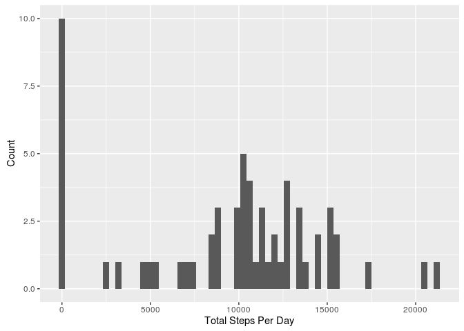
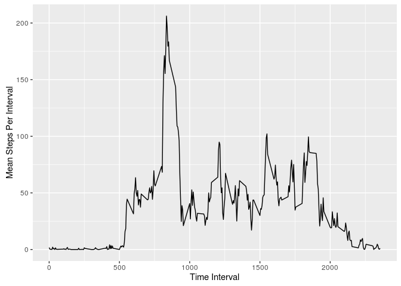
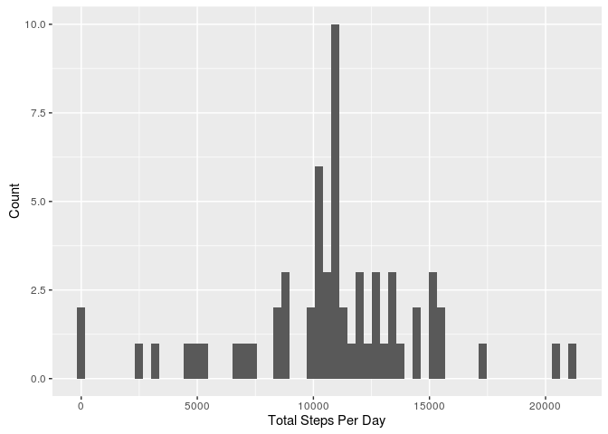
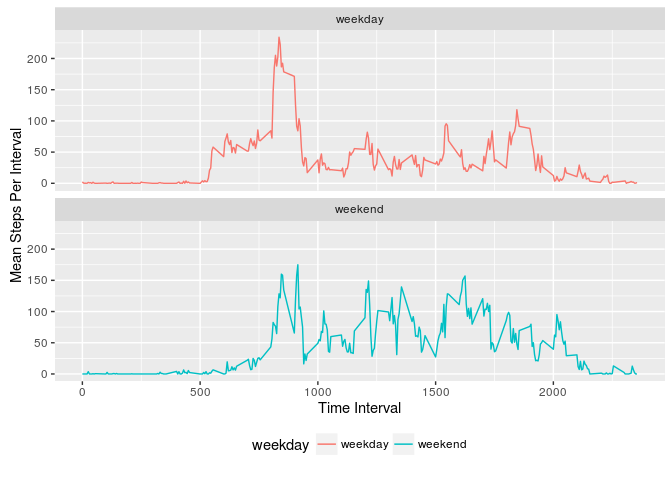

# Summary of Activity
DZastera  
August 7, 2016  


```r
suppressMessages(library(dplyr))
suppressMessages(library(ggplot2))
act <- read.csv("activity.csv")
```

## Total Steps Per Day

The total number of steps taken per day is summarized in this table:


```r
tot_steps <- act %>% group_by(date) %>% summarise(Total = sum(steps, na.rm=TRUE))
print(data.frame(tot_steps), row.names=FALSE)
```

```
##        date Total
##  2012-10-01     0
##  2012-10-02   126
##  2012-10-03 11352
##  2012-10-04 12116
##  2012-10-05 13294
##  2012-10-06 15420
##  2012-10-07 11015
##  2012-10-08     0
##  2012-10-09 12811
##  2012-10-10  9900
##  2012-10-11 10304
##  2012-10-12 17382
##  2012-10-13 12426
##  2012-10-14 15098
##  2012-10-15 10139
##  2012-10-16 15084
##  2012-10-17 13452
##  2012-10-18 10056
##  2012-10-19 11829
##  2012-10-20 10395
##  2012-10-21  8821
##  2012-10-22 13460
##  2012-10-23  8918
##  2012-10-24  8355
##  2012-10-25  2492
##  2012-10-26  6778
##  2012-10-27 10119
##  2012-10-28 11458
##  2012-10-29  5018
##  2012-10-30  9819
##  2012-10-31 15414
##  2012-11-01     0
##  2012-11-02 10600
##  2012-11-03 10571
##  2012-11-04     0
##  2012-11-05 10439
##  2012-11-06  8334
##  2012-11-07 12883
##  2012-11-08  3219
##  2012-11-09     0
##  2012-11-10     0
##  2012-11-11 12608
##  2012-11-12 10765
##  2012-11-13  7336
##  2012-11-14     0
##  2012-11-15    41
##  2012-11-16  5441
##  2012-11-17 14339
##  2012-11-18 15110
##  2012-11-19  8841
##  2012-11-20  4472
##  2012-11-21 12787
##  2012-11-22 20427
##  2012-11-23 21194
##  2012-11-24 14478
##  2012-11-25 11834
##  2012-11-26 11162
##  2012-11-27 13646
##  2012-11-28 10183
##  2012-11-29  7047
##  2012-11-30     0
```

The historgram of steps per day is presented in this plot:

```r
ggplot(tot_steps, aes(x=Total))+
  geom_histogram(bins=61)+
  labs(x = "Total Steps Per Day", y = "Count")
```

<!-- -->

The mean number of steps per day is 9354.2295082 and the median number of steps per day is 10395.

## Average Daily Pattern


```r
step_ts <- act %>% group_by(interval) %>% summarise(avg=mean(steps, na.rm=TRUE))
ggplot(step_ts, aes(x=interval, y=avg))+
  geom_line()+
  labs(x = "Time Interval", y = "Mean Steps Per Interval")
```

<!-- -->

The maximum average number of steps taken occurs in the 392 interval.

## Analysis of NAs

The total number of missing values in the dataset is 2304.

NAs in the dataset can be replaced by the interval mean with:


```r
imputed <- act %>% group_by(interval) %>% mutate(imp_step = mean(steps, na.rm=TRUE))
imputed$steps[is.na(imputed$steps)] <- imputed$imp_step[is.na(imputed$steps)]
```

Now, the total steps taken each day is:


```r
tot_steps_imp <- imputed %>% group_by(date) %>% summarise(Total = sum(steps, na.rm=TRUE))
print(data.frame(tot_steps_imp), row.names=FALSE)
```

```
##        date    Total
##  2012-10-01 10766.19
##  2012-10-02   126.00
##  2012-10-03 11352.00
##  2012-10-04 12116.00
##  2012-10-05 13294.00
##  2012-10-06 15420.00
##  2012-10-07 11015.00
##  2012-10-08 10766.19
##  2012-10-09 12811.00
##  2012-10-10  9900.00
##  2012-10-11 10304.00
##  2012-10-12 17382.00
##  2012-10-13 12426.00
##  2012-10-14 15098.00
##  2012-10-15 10139.00
##  2012-10-16 15084.00
##  2012-10-17 13452.00
##  2012-10-18 10056.00
##  2012-10-19 11829.00
##  2012-10-20 10395.00
##  2012-10-21  8821.00
##  2012-10-22 13460.00
##  2012-10-23  8918.00
##  2012-10-24  8355.00
##  2012-10-25  2492.00
##  2012-10-26  6778.00
##  2012-10-27 10119.00
##  2012-10-28 11458.00
##  2012-10-29  5018.00
##  2012-10-30  9819.00
##  2012-10-31 15414.00
##  2012-11-01 10766.19
##  2012-11-02 10600.00
##  2012-11-03 10571.00
##  2012-11-04 10766.19
##  2012-11-05 10439.00
##  2012-11-06  8334.00
##  2012-11-07 12883.00
##  2012-11-08  3219.00
##  2012-11-09 10766.19
##  2012-11-10 10766.19
##  2012-11-11 12608.00
##  2012-11-12 10765.00
##  2012-11-13  7336.00
##  2012-11-14 10766.19
##  2012-11-15    41.00
##  2012-11-16  5441.00
##  2012-11-17 14339.00
##  2012-11-18 15110.00
##  2012-11-19  8841.00
##  2012-11-20  4472.00
##  2012-11-21 12787.00
##  2012-11-22 20427.00
##  2012-11-23 21194.00
##  2012-11-24 14478.00
##  2012-11-25 11834.00
##  2012-11-26 11162.00
##  2012-11-27 13646.00
##  2012-11-28 10183.00
##  2012-11-29  7047.00
##  2012-11-30 10766.19
```

The historgram of steps per day with the imputed data is:

```r
ggplot(tot_steps_imp, aes(x=Total))+
  geom_histogram(bins=61)+
  labs(x = "Total Steps Per Day", y = "Count")
```

<!-- -->

The mean number of steps per day is 1.0766189\times 10^{4} and the median number of steps per day is 1.0766189\times 10^{4}.

The imputed dataset has a larger number of mean steps per day and a larger median number of steps per day.


## Impact of Weekdays


```r
act$weekday <- ifelse(weekdays(as.Date(act$date)) %in% c("Saturday","Sunday"),"weekend", "weekday") 
```


```r
step_ts_weekday <- act %>% group_by(interval, weekday) %>% summarise(avg=mean(steps, na.rm=TRUE))
ggplot(step_ts_weekday, aes(x=interval, y=avg, colour=weekday))+
  geom_line()+
  facet_wrap(~weekday, ncol=1)+
  labs(x = "Time Interval", y = "Mean Steps Per Interval")+
  theme(legend.position="bottom")
```

<!-- -->

